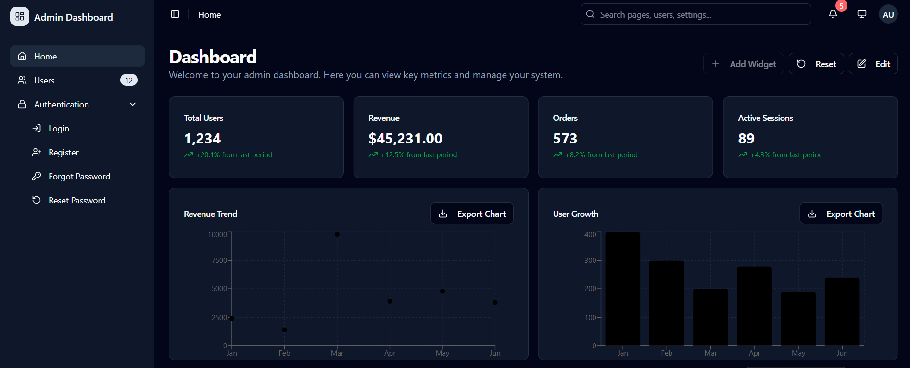

# Shadcn Admin Panel Template

Admin Dashboard UI with shadcn/ui (Vite + Typescript)

## 📸 Screenshot



A comprehensive, production-ready admin panel template built with modern React technologies. This template provides a solid foundation for building admin dashboards with authentication, user management, and customizable widgets.

## ✨ Features

### 🎨 **Modern UI/UX**
- **Shadcn/ui Components** - Beautiful, accessible components
- **Dark/Light Theme** - System-aware theme switching
- **Responsive Design** - Mobile-first approach
- **Clean Typography** - Inter, Roboto, and Poppins fonts

### 🔐 **Authentication System**
- Login/Register pages
- Password reset functionality
- Protected routes
- Session management
- Role-based permissions

### 📊 **Dashboard & Analytics**
- Interactive dashboard widgets
- Drag-and-drop layout
- Customizable charts (Recharts)
- Real-time data visualization
- Grid-based widget system

### 🧭 **Navigation & Layout**
- Collapsible sidebar
- Breadcrumb navigation
- Mobile-responsive header
- Tab-based account management
- Clean routing structure

### 🛠️ **Developer Experience**
- TypeScript support
- Form validation with Zod
- React Hook Form integration
- TanStack Query for data fetching
- Hot module replacement
- Comprehensive testing setup

## 🚀 Tech Stack

### **Core Framework**
- **React** `^19.1.1` - Latest React with concurrent features
- **TypeScript** `~5.9.3` - Type-safe development
- **Vite** `rolldown-vite@latest` - Lightning-fast build tool with Rolldown

### **UI & Styling**
- **Tailwind CSS** `^4.1.16` - Utility-first CSS framework
- **Shadcn/ui** - High-quality React components
- **Radix UI** `^1.x` - Unstyled, accessible components
- **Lucide React** `^0.552.0` - Beautiful icon library
- **Next Themes** `^0.4.6` - Theme management

### **State Management & Data**
- **TanStack Query** `^5.90.6` - Powerful data synchronization
- **TanStack Router** `^1.134.12` - Type-safe routing
- **React Hook Form** `^7.66.0` - Performant forms
- **Zod** `^3.25.76` - Schema validation

### **Charts & Visualization**
- **Recharts** `^2.15.4` - Composable charting library
- **React Grid Layout** `^1.5.2` - Draggable grid system

### **Development Tools**
- **ESLint** `^9.36.0` - Code linting
- **Vitest** `^4.0.6` - Unit testing
- **Playwright** `^1.56.1` - E2E testing
- **React Query Devtools** `^5.90.2` - Development tools

## 📦 Installation

### Prerequisites
- Node.js 18+ 
- npm, yarn, or pnpm

### Quick Start

```bash
# Clone the repository
git clone https://github.com/rohitsoni007/shadcn-admin.git
cd shadcn-admin

# Install dependencies
npm install

# Start development server
npm run dev

# Open http://localhost:5173
```

### Available Scripts

```bash
# Development
npm run dev          # Start dev server
npm run build        # Build for production
npm run preview      # Preview production build

# Testing
npm run test         # Run unit tests
npm run test:watch   # Run tests in watch mode
npm run test:ui      # Run tests with UI
npm run test:e2e     # Run E2E tests
npm run test:e2e:ui  # Run E2E tests with UI

# Code Quality
npm run lint         # Lint code
```

## 🏗️ Project Structure

```
src/
├── components/          # Reusable UI components
│   ├── ui/             # Shadcn/ui components
│   ├── auth/           # Authentication components
│   ├── dashboard/      # Dashboard widgets
│   ├── layout/         # Layout components
│   └── theme-provider/ # Theme management
├── contexts/           # React contexts
├── hooks/              # Custom React hooks
├── lib/                # Utility functions
├── routes/             # TanStack Router routes
├── types/              # TypeScript type definitions
└── main.tsx           # Application entry point
```

## 🎯 Key Features Breakdown

### Authentication System
- **Mock Authentication** - Development-ready auth system
- **Protected Routes** - Route-level protection
- **Role-based Access** - Permission-based UI rendering
- **Session Management** - Automatic token refresh

### Dashboard Widgets
- **Draggable Layout** - Rearrange widgets via drag & drop
- **Resizable Widgets** - Customize widget dimensions
- **Chart Integration** - Line charts, bar charts, stats cards
- **Persistent Layout** - Saves layout preferences

### Account Management
- **Tabbed Interface** - Profile, Password, Settings tabs
- **Form Validation** - Zod schema validation
- **Theme Preferences** - User-specific theme settings
- **Security Settings** - Password change, privacy controls

### Responsive Design
- **Mobile Sidebar** - Collapsible navigation
- **Adaptive Layout** - Optimized for all screen sizes
- **Touch-friendly** - Mobile gesture support

## 🔧 Configuration

### Environment Variables
Create a `.env.local` file:

```env
# API Configuration
VITE_API_BASE_URL=http://localhost:3000/api
VITE_APP_NAME=Admin Panel

# Authentication
VITE_AUTH_SECRET=your-secret-key

# Development
VITE_ENABLE_DEVTOOLS=true
```

### Theme Customization
This project uses Tailwind CSS 4 with Vite plugin. Customize themes by:

1. **CSS Variables**: Modify theme colors in `src/index.css`
2. **Component Variants**: Update component styles in `src/components/ui/`
3. **Theme Provider**: Configure theme settings in `src/components/theme-provider.tsx`

## 🧪 Testing

### Unit Tests
```bash
# Run all tests
npm run test

# Run specific test file
npm run test -- auth.test.tsx

# Run tests in watch mode
npm run test:watch
```

### E2E Tests
```bash
# Run E2E tests
npm run test:e2e

# Run E2E tests with UI
npm run test:e2e:ui
```

## 🚀 Deployment

### Build for Production
```bash
npm run build
```

### Deploy to Vercel
```bash
npm install -g vercel
vercel --prod
```

### Deploy to Netlify
```bash
npm run build
# Upload dist/ folder to Netlify
```

## 🤝 Contributing

We welcome contributions! Here's how you can help:

### Development Workflow
1. Fork the repository from [rohitsoni007/shadcn-admin](https://github.com/rohitsoni007/shadcn-admin)
2. Create a feature branch (`git checkout -b feature/amazing-feature`)
3. Commit your changes (`git commit -m 'Add amazing feature'`)
4. Push to the branch (`git push origin feature/amazing-feature`)
5. Open a Pull Request

### Guidelines
- Use TypeScript for all new code
- Follow the existing code style
- Add tests for new features
- Update documentation as needed
- Ensure responsive design
- Follow accessibility best practices

## 📝 License

This project is licensed under the MIT License - see the [LICENSE](LICENSE) file for details.

---

**Made with ❤️ using Vite + shadcn/ui**

⭐ **Star this repo if you find it helpful!**